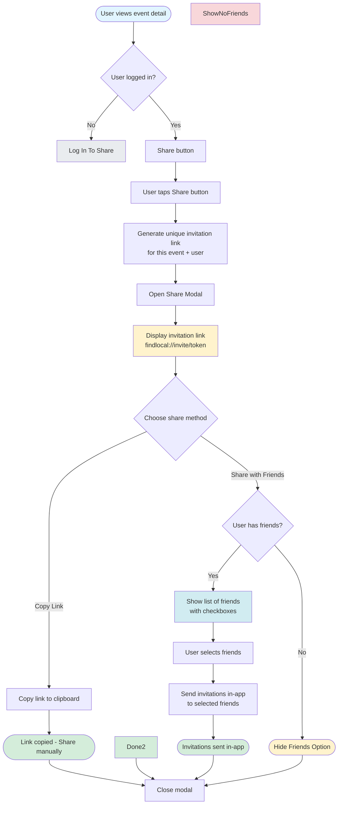
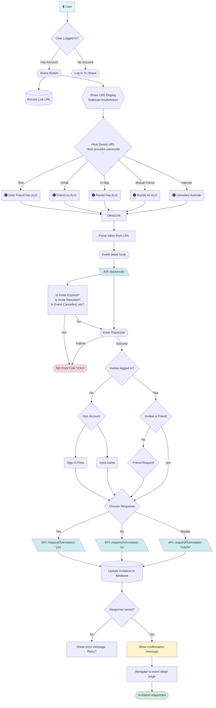

# Find Local Social Share - Event Invitations

## Requirements
* Hosts must have an account to invite other people
* Any invited people are required to have a passcode supplied by the host to respond
* Invited people can respond and attend without an account
* Invited people have the option to request to be "friends" with person inviting them as a part of the flow
* Invited people can see event details even without an account
* Invitation links are generated for each event invitation. When the date of the event passes, the invitation is invalidated
* Emails are private information
* Usernames are public information
* Invitees can respond with: **Yes**, **No**, or **Maybe**
* Events can show count the number of people who have shared them
* Events can show count the number of people who say they are attending

## Visibility and Privacy
* Friends can see other friends that are attending
* Hosts can see any people that have responded to the share link
    * If they are in-app friends, hosts can see who they have invited
    * If invited people don't have an account, hosts can see the "name" that was entered
    * If invited people have an account, host can see their username in response
* Hosts can request to "friend" any people they invited and who have an account
* Invited people can request to "friend" the host as a part of being invited
* It is essential not to leak email information
* Any photos need to have GPS info stripped (future feature)
* It is essential not to leak location information

# Why this is a good idea
- Email chains are tedious
- Group chat is messy and hard to manage
- Partiful is the evil empire
- Joyraft has a stupid name


# Event Invitations - UX Flow Diagram

### Invitation Creation Flow

1. User views an event detail
1. If user is logged in, they see a Share button
1. User taps associated "Share" button
1. Modal opens with a unique share link displayed
1. Provide options to:
   - Copy link to clipboard
   - If user has friends, can share in-app



## Invitation Acceptance/Rejection Flow

1. Invitee receives and clicks the invitation link (via Text, Email, In-App, Mutual Friend, or Internet)
2. Deep link opens the app with the invitation token
3. Parse token from the URL
4. Route to event detail route
5. Call API to fetch invitation details (`API::fetchInvite`)
6. Check if invitation is valid
   - If expired: Show denial message and end flow
   - If event is canceled: Show denial
   - If event is revoked: Show denial
   - If valid: Continue to passcode
7. Prompt user to enter passcode
   - If passcode validation fails: Show denial message and end flow. The random internet invitation should fail this step.
   - If passcode validation succeeds: Continue to authentication check
8. Check if invitee is logged in
9. If not logged in:
   - Check if invitee has an account
   - If has account: Proceed through sign-in flow
   - If no account: Collect user information (input name)
   - After sign-in or info collection: Continue to response selection
10. If logged in:
    - Check if invitee is a friend of the inviter
    - If not a friend: Show friend request option
    - If already a friend: Proceed directly to response selection
11. User chooses response: **Yes**, **No**, or **Maybe**
12. Call API to respond to invitation (`API::respondToInvitation` with selected response)
13. Update invitation record in database
14. Check if response was saved successfully
    - If not saved: Show error message and provide retry option
    - If saved: Continue to confirmation
15. Show confirmation message
16. Navigate to event detail page
17. Flow complete - invitation responded



## Data Model

```sql
CREATE TABLE public.event_invitations (
  id UUID PRIMARY KEY DEFAULT gen_random_uuid(),
  event_id UUID NOT NULL REFERENCES public.events_gold(id) ON DELETE CASCADE,
  inviter_id UUID NOT NULL REFERENCES auth.users(id) ON DELETE CASCADE,
  invitee_id UUID REFERENCES auth.users(id) ON DELETE SET NULL, -- NULL if invitee hasn't signed up yet
  invitee_name TEXT, -- Only stored if invitee doesn't have account yet
  invite_token TEXT UNIQUE NOT NULL, -- Secure token for the invitation link
  response TEXT CHECK (response IN ('yes', 'no', 'maybe', 'pending')) DEFAULT 'pending',
  responded_at TIMESTAMPTZ,
  created_at TIMESTAMPTZ DEFAULT NOW(),
  expires_at TIMESTAMPTZ, -- Optional: invitations can expire

  -- Ensure one invitation per event per inviter/invitee pair
  UNIQUE(event_id, inviter_id, COALESCE(invitee_id::text, invitee_email))
);
```

### Row Level Security (RLS) Policies

```sql
-- Enable RLS
ALTER TABLE public.event_invitations ENABLE ROW LEVEL SECURITY;

-- Users can see invitations they created
CREATE POLICY "Users can view invitations they sent"
  ON public.event_invitations FOR SELECT
  USING (auth.uid() = inviter_id);

-- Users can see invitations sent to them
CREATE POLICY "Users can view invitations received"
  ON public.event_invitations FOR SELECT
  USING (
    auth.uid() = invitee_id
    OR (
      invitee_email IS NOT NULL
      AND invitee_email = (SELECT email FROM auth.users WHERE id = auth.uid())
    )
  );

-- Authenticated users can create invitations (must be logged in)
CREATE POLICY "Authenticated users can create invitations"
  ON public.event_invitations FOR INSERT
  WITH CHECK (auth.uid() = inviter_id AND auth.uid() IS NOT NULL);

-- Users can update their own responses
CREATE POLICY "Users can update their own responses"
  ON public.event_invitations FOR UPDATE
  USING (
    auth.uid() = invitee_id
    OR (
      invitee_email IS NOT NULL
      AND invitee_email = (SELECT email FROM auth.users WHERE id = auth.uid())
    )
  )
  WITH CHECK (
    auth.uid() = invitee_id
    OR (
      invitee_email IS NOT NULL
      AND invitee_email = (SELECT email FROM auth.users WHERE id = auth.uid())
    )
  );

-- Inviters can delete invitations they sent
CREATE POLICY "Inviters can delete invitations"
  ON public.event_invitations FOR DELETE
  USING (auth.uid() = inviter_id);
```

## API Layer

### `src/api/invitations.ts`

```
createEventInvitation()
getInvitationByToken()
```

```typescript

/**
 * Create an event invitation
 * @param eventId - The ID of the event to invite to
 * @param expiresInHours - Optional expiration time (default: 168 hours / 7 days)
 * 
 * Note we will likely need two functions
 */
export async function generateInviteURL(
  eventId: string,
  expiresInHours: number = 168
): Promise<CreateInvitationResult> {
    // TODO: Implementation
}

/**
 * Get invitation details by token (for deep link handling)
 */
export async function getInvitationByToken(
  token: string
): Promise<EventInvitation | null> {
    // TODO: Implementation

    // const { data, error } = await supabase
    //   .from("event_invitations")
    //   .select("*")
    //   .eq("invite_token", token)
    //   .single();
}

/**
 * Respond to an invitation (yes/no/maybe).
 * 
 * If responding without an account, user can send along a name
 * otherwise, it will be their currently logged in profile id.
 * 
 * If we don't have a logged in user, a text name is required.
 * We autogenerate this as well, but the host will need to know
 * who the anonymous person is (outside app communication)
 */
export async function respondToInvitation(
  token: string,
  response: "yes" | "no" | "maybe"
  name?: string
): Promise<{
  success: boolean;
  event_id: string | null;
  inviter_username: string | null;
}> {
    // TODO: Implementation
}

/**
 * Get all invitations created by the current user
 */
export async function getCreatedInvitations(): Promise<EventInvitation[]> {
    // TODO: Implementation

    // const { data, error } = await supabase
    //       .from("event_invitations")
    //       .select("*")
    //       .eq("inviter_id", (await supabase.auth.getUser()).data.user?.id)
    //       .order("created_at", { ascending: false });
}

/**
 * Get all invitations received by the current user
 */
export async function getReceivedInvitations(): Promise<EventInvitation[]> {
    // TODO: Implementation

    // const { data, error } = await supabase
    //   .from("event_invitations")
    //   .select("*")
    //   .eq("invitee_id", (await supabase.auth.getUser()).data.user?.id)
    //   .order("created_at", { ascending: false });
}
```

## Components & UI

## Deep Link Configuration

The app already has `"scheme": "findlocal"` configured. We'll use:

- Universal link: `https://https://findlocal.community/invite/{token}`
- Deep link: `findlocal://invite/{token}`

### Update `app/_layout.tsx`

Add deep link handling:

```typescript
import { Linking } from "expo-linking";
import { useEffect } from "react";

// Handle deep links
useEffect(() => {
  // Handle initial URL if app was opened via deep link
  Linking.getInitialURL().then((url) => {
    if (url) handleDeepLink(url);
  });

  // Handle deep links while app is running
  const subscription = Linking.addEventListener("url", ({ url }) => {
    handleDeepLink(url);
  });

  return () => subscription.remove();
}, []);

function handleDeepLink(url: string) {
  // Parse findlocal://invite/{token}
  const match = url.match(/findlocal:\/\/invite\/([^\/]+)/);
  if (match && match[1]) {
    const token = match[1];
    router.push(`/invite/${token}`);
  }
}
```

### Profile Page
* List of invitations created
* For any invitation, all of the responses
    * Host can manually enter a name and a response for an invitation
    * Host can invite someone to create an account on the site
    * Host can create a friend request for any response
    * Host can revoke the invitation
* List of invitations received (only if invited while having an account)

### Event Detail
* Share Button
* Count of times it has been shared
* Count of people that said they would attend

### Invite Response
* Yes, No, Maybe
* Create a new account
* Friend request for person inviting you

## Security Considerations

1. **Token Security:**
   - Tokens are cryptographically secure (32 random bytes, base64url encoded)
   - Tokens are unique and not guessable
   - Tokens expire after set time period

2. **Privacy:**
   - Emails are never exposed in API responses or UI
   - Only usernames are displayed to other users
   - RLS ensures users can only see their own invitations

3. **Validation:**
   - Only authenticated users can create invitations
   - Invitation links work for unauthenticated users (for discovery) but require a passcode to respond
   - Server-side functions validate all inputs
   - Invitation tokens are validated before accepting responses
   - Expiration dates are checked

## Future Enhancements

* **Discounted tickets:** Get discount codes from local businesses when buying with an invite
* **Invitation by username:** Allow inviting users by username (if they have public profiles)
* **Group invitations:** Invite multiple friends at once
* **Invitation notifications:** Push notifications when receiving invitations
* **Calendar integration:** Add event to calendar when responding "Yes"
* **Invitation reminders:** Optional reminders before event date
